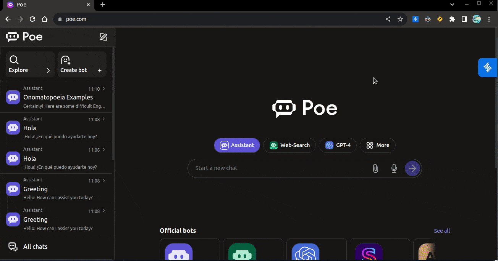

<h1 align="center">AI Prompt Snippets</h1>

  <a href="https://ai-prompt-snippets.vercel.app/getting-started/get-started/">Documentation</a> |
  <a href="https://ai-prompt-snippets.vercel.app/getting-started/download/">Download</a>

## Why do we need this extension?

This chrome extension enables you to create libraries of reusable snippets containing custom questions, templates, and prompts. Instead of manually typing detailed queries multiple times, you can simply select the appropriate snippet and insert it into your chat with a single click.

## Examples

For instance, you can create an "Email" snippet with subject, recipient, body text, tone, and length parameters, allowing you to quickly generate AI-assisted email drafts. Similarly, a "Define" snippet can instantly provide word definitions and example sentences showcasing word usage.

### Email Snippet

### Definition Snippet

## Tech Stack
The AI Prompt Snippets chrome extension is built using the following technologies:

- [React JS](https://react.dev/) and [TypeScript](https://www.typescriptlang.org/)
- [Vite](https://vitejs.dev/) as the bundler
- [Bun](https://bun.sh/) as the package manager
- [Next UI](https://nextui.org/) as the UI component library
- [Tailwind CSS](https://tailwindcss.com/) for styling
- [Headless UI](https://headlessui.com/) for building other atomic ui component that is not provided by Next UI 
- [Ladle](https://ladle.dev/) for developing component in isolation
- [Cypress](https://docs.cypress.io/guides/component-testing/overview) for component testing
- [Playwright](https://playwright.dev/) for extension e2e testing
- [Starlight](https://starlight.astro.build/) for documentation ([astro](https://astro.build/) based framework))
